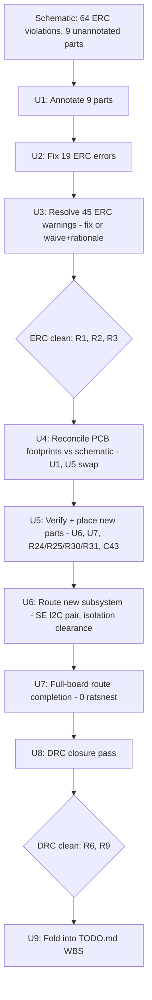

# fix: LibreServo v4 ERC/DRC-clean, manufacture-ready KiCad project

**Target repo:** LibreServo_v4 (`/home/steve/Documents/Vocation/Employers/Griffing.tech/designs/LibreServo_v4`)

**Product Contract preservation:** No prior unified plan or brainstorm exists for this
work. This plan is written directly from repository state (`TODO.md` §5/§6, `AGENTS.md`,
`REFERENCES.md`) per the planning bootstrap. `TODO.md` §1-4's settled schematic-level
decisions (MCU pin map, secure-element wiring, trust protocol) are treated as fixed
inputs, not re-opened.

**Research disclosure:** This plan was authored from diagnostics already produced
in-session (KiCad 9.0.2 `sch erc --format json`, the `kicad` skill's
`analyze_schematic.py`/`analyze_pcb.py`, and direct inspection of the raw
`.kicad_sch`/`.kicad_pcb`/`.kicad_pro` files) rather than a separate dispatched
research subagent — the diagnostic work the research phase would normally produce had
already been completed and verified this session. No external research was warranted:
the applicable standards (IPC-2221A spacing/current, isolation clearance per the
transceiver datasheets) are already the kind of reference this repo's own
`REFERENCES.md`/`AGENTS.md` governance requires citing directly from the datasheet, not
from a web search.

---

## Summary

`LibreServo-v4.0.0.kicad_sch` carries the authoritative v4 design intent (117
components, 98 nets: TI MSPM0G3518-Q1 MCU, isolated RS-485/CAN-FD transceiver pair,
OPTIGA Trust M secure element) but fails KiCad ERC with 64 violations (19 error / 45
warning), and 9 components remain un-annotated (`U$1`...`U$100`) from the original
EAGLE import. `LibreServo-v4.0.0.kicad_pcb` is confirmed — by direct grep, not
inference — to still be the **upstream v2.3.1 EAGLE-imported layout**: it has no `U6`
(ADM3055E), no `U7` (OPTIGA Trust M), and none of `R24`/`R25`/`R30`/`R31`/`C43`. This
closes the diagnostic question `TODO.md` 5.0 left open and confirms the premise stated
there. This plan sequences schematic hygiene first (so the netlist that drives layout
is trustworthy), then a genuine v4 layout pass that adds the missing subsystem to the
existing, physically-constrained 6-layer board outline (36.5 x 42.9 mm, shaped to fit
the LibreServo servo housing per `3D/LS_body.stl`), then routes to 0 DRC. Gerber export
is explicitly out of scope.

## Problem Frame

**Confirmed diagnostic (this session, KiCad 9.0.2 `kicad-cli sch erc`, `analyze_pcb.py
--full`, raw-file grep):**

1. **Schematic ERC: 64 violations, 19 error / 45 warning.** By type:
   `endpoint_off_grid` (28), `power_pin_not_driven` (14), `unconnected_wire_endpoint`
   (6), `similar_label_and_power` (4), `pin_not_connected` (3), `multiple_net_names`
   (3), `label_multiple_wires` (3), `pin_to_pin` (2), `no_connect_connected` (1). All
   are inherited-from-EAGLE-import hygiene issues per `TODO.md` §6, not design-intent
   errors — none require changing a net name, pin assignment, or component choice that
   `TODO.md` §1-4 already closed.
2. **9 components are un-annotated**: `U$1`/`U$2` (`SLOT`), `U$3`/`U$4` (`FFC-5`),
   `U$5` (`HEADER_4_1.27_0.3`), `U$6` (`POTEN_SERVO`), `U$8`/`U$9`
   (`JST_PH-4_HOLEB`), `U$100` (`OSCILATOR`). (The additional `#U$7`...`#U$27` refs are
   `NC_MARKER`/no-connect-flag pseudo-symbols and two JST connectors that legitimately
   keep `#`-prefixed refs — they are not part of this defect.) This is the concrete
   cause of `TODO.md` 6.1's "schematic has annotation errors" netlist-export warning.
3. **The PCB is the frozen v2.3.1 EAGLE import, confirmed by grep**, not inference:
   present refs are `U1`-`U5`, `U10`, `R1`-`R20`, `C1`-`C24`, `B1`/`B2`, `M1`-`M5`,
   `NTC0`, `RGB0` — **absent** are `U6`, `U7`, `R24`, `R25`, `R30`, `R31`, `C43`. This
   settles `TODO.md` 5.0's open question: the finding recorded there (2026-08-23) is
   still true today. `U1`'s footprint in the schematic is already correctly set to
   `Texas_RHB0032E_VQFN-32-1EP_5x5mm_P0.5mm_EP3.45x3.45mm` (MSPM0G3518-Q1's real
   package) — the PCB's `U1` footprint has not caught up.
4. **Board physical constraint**: the existing `.kicad_pcb` outline is not an
   arbitrary rectangle — it is a 32-edge polygon (28 lines + 4 arcs) sized 36.5 x 42.9
   mm that was imported from the EAGLE `.brd`, itself shaped to fit inside the
   LibreServo servo housing (`PCB/3D/LS_body.stl`). The new layout must fit new
   components (`U6`, `U7`, `R24`/`R25`/`R30`/`R31`, `C43`) inside this existing
   outline — this is not a free-form re-layout.
5. **Board class already configured**: 6 copper layers (`F.Cu`, `In1`-`In4.Cu`,
   `B.Cu`), `min_clearance` 0.12649 mm (~5 mil, EAGLE-derived), `min_via_diameter`
   0.5 mm, a `Diff` net class already defined (0.1778 mm width / 0.25 mm gap) for
   future differential routing. This plan carries these forward rather than
   re-deriving a stackup.
6. **Datasheets for every new-to-layout part are already in `PCB/datasheets/`**:
   `mspm0g3518-q1.pdf`, `ADM2582E-ADM2587E.pdf`, `ADM3055E-ADM3057E.pdf`,
   `infineon-optiga-trust-m-datasheet-en.pdf` — footprint/package verification in U5
   below cites these directly, not vendor package generalities.

**What this plan is not**: it does not re-open any TODO.md §1-4 schematic decision
(MCU pin map, secure-element wiring, trust protocol), does not touch `firmware/`, and
does not produce Gerbers/drill files or any fabrication output (`TODO.md` §5 stops
short of that; gerber export is explicitly out of scope per the invoking request).

---

## Requirements

- **R1**: Schematic ERC reports 0 `error`-severity violations.
- **R2**: Schematic ERC reports 0 `warning`-severity violations, or every surviving
  warning is explicitly waived in-schematic (KiCad ERC exclusion) with a one-line
  rationale recorded in this repo's WBS, not silently left outstanding.
- **R3**: All 9 currently un-annotated components (`U$1`, `U$2`, `U$3`, `U$4`, `U$5`,
  `U$6`, `U$8`, `U$9`, `U$100`) carry real, non-conflicting reference designators;
  `kicad-cli sch export netlist` (or equivalent) produces no annotation warning.
- **R4**: `LibreServo-v4.0.0.kicad_pcb` contains every component in
  `LibreServo-v4.0.0.kicad_sch` — specifically confirms `U6`, `U7`, `R24`, `R25`,
  `R30`, `R31`, `C43` are present with the schematic's assigned footprints, and no
  stale v2.3.1-only footprint (the old `U1` STM32F301/2 QFN32, old `U5` SiT3485
  MSOP-8) remains un-reconciled against the current schematic part.
- **R5**: Every net in the schematic is routed on the PCB (0 ratsnest lines) using the
  existing 6-layer stackup and net classes; no new copper layer or stackup change is
  introduced.
- **R6**: `kicad-cli pcb drc` reports 0 `error`-severity violations against the
  project's own configured design rules (`min_clearance` 0.12649 mm etc. — not a
  relaxed or substituted rule set).
- **R7**: `SE_I2C_SCL`/`SE_I2C_SDA` (the secure-element I2C pair, `TODO.md` 5.3) are
  routed with matched, short length and adequate clearance from noisy/switching nets,
  consistent with Fast-mode 400 kHz operation (`firmware/pal/ls_board.h`).
  Trace-length/clearance figures used to judge "adequate" must cite the datasheet
  section they come from (see U7 below), not a general rule of thumb.
- **R8**: The two isolation barriers (`ADM2587E` RS-485 at `U5`, `ADM3055E` CAN-FD at
  `U6`) have their datasheet-specified creepage/clearance isolation gap enforced on
  copper on all layers (not just F.Cu) under the isolated-side pins, verified against
  the part's own datasheet figure, not IPC-2221A defaults alone (functional isolation
  in a data-only device is set by the part, not by mains-voltage tables).
- **R9**: The new layout still fits inside the existing board outline
  (`Edge.Cuts`) — no outline edit — and all footprint courtyards clear each other and
  the outline with no DRC courtyard-overlap violation.
- **R10**: Progress is folded into `TODO.md` as WBS sub-items under §5/§6 (closing
  those items where done, per this repo's `CLAUDE.md` governance), not left as a
  separate untracked plan.
- **Explicit non-requirement**: Gerber/drill export. Stop at a DRC-clean
  `.kicad_pcb`.

---

## Key Technical Decisions

**KTD1 — Schematic hygiene before layout, strictly ordered.** Do not begin PCB
placement until R1-R3 are met. Rationale: `analyze_pcb.py`'s footprint-vs-schematic
cross-reference and any "Update PCB from Schematic" step both depend on a clean,
fully-annotated netlist; running them against a schematic with off-grid/dangling
wires and 9 unresolved reference designators risks silently importing the same
defects into the new layout. This mirrors `TODO.md`'s own dependency ordering (§6
before §5 makes sense even though §5 was opened first).

**KTD2 — `.kicad_pcb` is re-laid out in place, not replaced wholesale
(session-settled: user-directed — chosen over a from-scratch board: the physical
outline is a real housing constraint (`3D/LS_body.stl`) that a from-scratch board
would have to reverse-engineer anyway, and ~55 of ~62 non-passive-value components are
unchanged from the existing layout).** This answers `TODO.md` 5.0's open decision.
Concretely: keep `Edge.Cuts`, keep the 6-layer stackup and net classes, keep every
footprint whose schematic part is unchanged (passives, connectors, `U2`-`U4`,
`U10`), and only (a) swap the footprint under `U1` (MSPM0G3518-Q1's real QFN-32-EP
footprint replaces the stale STM32 one), (b) swap `U5`'s footprint from the old
SiT3485 MSOP-8 to `ADM2587E`'s SOIC-20W, (c) add `U6`, `U7`, `R24`, `R25`, `R30`,
`R31`, `C43` net-new. This is the smallest change that produces a v4-real board.

**KTD3 — Footprints for the three new/changed ICs are taken verbatim from the
schematic's already-set `Footprint` field, cross-checked against the local
datasheet, not re-selected from a generic library search.** The schematic already
carries `U1` -> `Texas_RHB0032E_VQFN-32-1EP_5x5mm_P0.5mm_EP3.45x3.45mm`, `U5`/`U6` ->
`Package_SO:SOIC-20W_7.5x12.8mm_P1.27mm`, `U7` ->
`Infineon_PG-USON-10-2-4_3x3mm_P0.5mm_EP1.7x2.5mm`. U5 below verifies each against
its datasheet's own package drawing before layout uses it, rather than trusting the
importer/schematic-author's footprint choice blind.

**KTD4 — ERC warnings are resolved, not blanket-waived, except where the warning is
a structural property of a connector/mechanical symbol.** E.g. `power_pin_not_driven`
on a servo-motor phase output pin (a power_out pin with no independent source) is a
legitimate waiver candidate; the same violation on an MCU `VDD` pin is not — it needs
an actual driven net. Each of the 45 warnings gets classified into "fix" or "waive
with rationale" during U2/U3, not auto-waived to hit R2 quickly.

---

## Scope Boundaries

**In scope**: schematic annotation and ERC hygiene; PCB footprint reconciliation
against the current schematic; placement and routing of the net-new v4 subsystem
(`U6`, `U7`, and their passives); full-board DRC closure; `TODO.md` WBS updates.

**Out of scope / deferred to follow-up work**:
- Gerber, drill, or any CAM/fabrication-output generation (explicit non-requirement
  above).
- Firmware changes (`firmware/`, `Src/`, `Inc/`) — untouched by this plan.
- `TODO.md` 4.11-4.14, 7.x security/firmware items — unrelated to ERC/DRC.
- Re-deriving the board stackup, net classes, or clearance rules from scratch — KTD2
  keeps the existing configured values.
- 3D/mechanical fit verification beyond "fits inside the existing Edge.Cuts outline"
  — a full mechanical mate check against `LS_body.stl` (e.g., component height
  clearance to the housing lid) is noted as a risk (see Risks) but not performed here;
  it would require the STEP/STL housing model loaded alongside the PCB 3D viewer,
  which is a separate, physically-verifiable follow-up step best done by the user
  with the assembled parts on hand.
- `TODO.md` 1.4.d/1.4.e (errata/datasheet intake gaps) — unrelated to this board's
  ERC/DRC state.

---

## High-Level Technical Design

Sequencing is strict top-to-bottom: each unit's entry condition is the prior unit's
exit condition (KTD1). U5-U8 all operate within the fixed `Edge.Cuts` outline from
KTD2 — no unit moves or edits the board outline.

---

## Implementation Units

### U1. Annotate the 9 orphaned schematic components

**Goal:** Resolve `TODO.md` 6.1's annotation-error warning by giving `U$1`, `U$2`,
`U$3`, `U$4`, `U$5`, `U$6`, `U$8`, `U$9`, `U$100` real, correctly-prefixed, non-
conflicting reference designators.

**Requirements:** R3

**Dependencies:** none (first unit)

**Files:**
- `PCB/kicad/LibreServo-v4.0.0.kicad_sch`

**Approach:**
1. For each of the 9 refs, determine the correct KiCad reference-designator class
   from its `lib_id`/function, following this schematic's existing convention (`U*`
   for ICs, but these are mechanical/connector parts so should likely take `J*` or a
   convention already used elsewhere in the file for the same footprint family —
   check existing `SERVO_SLOT`/`JST_PH` instances first and match, rather than
   inventing a new prefix scheme).
2. Re-annotate via KiCad's own annotate tool (`kicad-cli sch` has no direct
   annotate subcommand as of 9.0.2 — this is a GUI **Tools > Annotate Schematic**
   step, or scripted via `pcbnew`/`eeschema` Python if a headless path is preferred)
   rather than hand-editing UUIDs/refs in the S-expression, to guarantee KiCad's own
   uniqueness and back-annotation bookkeeping stays correct.
3. Re-run `analyze_schematic.py` afterward and confirm the `U$`/orphan refs are gone
   from `components[]`.

**Patterns to follow:** existing `SERVO_SLOT`, `JST_PH-4_HOLE_B` instances already
placed and annotated elsewhere in the same schematic — match their designator
convention exactly.

**Test scenarios:**
- Re-running `analyze_schematic.py` shows 0 components with a `U$`-form reference.
- `kicad-cli sch erc` no longer reports any annotation-related finding.
- No reference-designator collision introduced (every ref appears exactly once in
  `bom[]`).

**Verification:** `python3 <kicad-skill>/scripts/analyze_schematic.py
LibreServo-v4.0.0.kicad_sch --compact` shows `statistics.total_components` unchanged
(117) with no `U$`-prefixed reference in the component list.

---

### U2. Fix the 19 ERC error-severity violations

**Goal:** Bring schematic ERC error count to 0 (R1) without touching any settled net
name, pin assignment, or component choice from `TODO.md` §1-4.

**Requirements:** R1

**Dependencies:** U1 (annotation must be stable before re-running ERC, since fixing
wiring around a `U$`-ref part before it has its final designator risks redoing the
edit)

**Files:**
- `PCB/kicad/LibreServo-v4.0.0.kicad_sch`

**Approach:** Work the specific error-severity types from the confirmed ERC report
(re-run `kicad-cli sch erc --format json --severity-all` and filter `severity ==
"error"` to get exact locations — do not re-derive from the summary counts alone,
since error/warning splits by type were not fully cross-tabulated in the diagnostic
pass):
1. `unconnected_wire_endpoint` (6) and `pin_not_connected` (3) — trace each to
   either a genuine missing connection (route the wire to its intended pin/label) or
   a deliberately-unused pin that needs an explicit no-connect flag.
2. `no_connect_connected` (1) — a no-connect flag was placed on a pin that is
   actually wired; remove the flag (the wire is correct) rather than removing the
   wire.
3. `pin_to_pin` (2) — two incompatible pin types are joined on the same net (e.g. two
   driven outputs). Identify the two pins from the report and resolve per the
   correct topology for that net (usually one pin's type was mis-set on the symbol,
   or the net legitimately needs a buffer/resistor already elsewhere in the design —
   check before assuming a symbol edit is needed).
4. Any remaining error-severity `endpoint_off_grid` instances (`endpoint_off_grid`
   is reported as one undifferentiated warning+error mix in the summary; the exact
   split needs the per-violation JSON) — snap to the nearest 50 mil (or the file's
   actual grid setting) grid point without changing the wire's electrical endpoint.

**Execution note:** Re-run `kicad-cli sch erc --format json --severity-all` after
every batch of ~10 fixes rather than at the very end — off-grid and unconnected-
endpoint fixes can cascade (moving one wire can reveal a previously-hidden
overlapping violation).

**Test scenarios:**
- `kicad-cli sch erc --format json --severity-all` reports 0 entries with
  `"severity": "error"`.
- Every net that existed before this unit still exists with the same pin membership
  (no net accidentally merged or split) — diff `analyze_schematic.py`'s `nets{}` key
  set before/after.
- No `TODO.md` §1-4 pin assignment (`PA1`/`SE_I2C_SCL`, `PA8`/`SE_I2C_SDA`,
  `PA14`/`SE_RST`) changed.

**Verification:** `kicad-cli sch erc --format json --severity-all` exits with a
report containing zero `"severity": "error"` entries.

---

### U3. Resolve the 45 ERC warning-severity violations

**Goal:** Meet R2 — 0 warnings, or each survivor explicitly waived with a recorded
one-line rationale.

**Requirements:** R2

**Dependencies:** U2 (fixing errors first avoids re-classifying a violation that
disappears once the underlying error is fixed)

**Files:**
- `PCB/kicad/LibreServo-v4.0.0.kicad_sch`
- `TODO.md` (record any waiver rationale under §6)

**Approach:** Per KTD4, classify each of the 6 warning-type categories:
1. `endpoint_off_grid` (remaining, non-error instances) — same grid-snap fix as U2.
2. `power_pin_not_driven` (14) — for each, check whether the pin is a true supply
   input needing a `PWR_FLAG`/source net, or a servo-motor/output pin the analyzer
   correctly flags as "power_out with no driver" but which is fine because it's a
   load, not a source (per the `kicad` skill's own severity table: `power_out`/
   passive-pin instances of this class are informational, not a real defect). Fix
   the former with an actual `PWR_FLAG` or verified rail connection; waive the
   latter with a one-line note.
3. `similar_label_and_power` (4) — rename the local label(s) that collide with a
   power symbol's implicit name, or confirm they're intentionally the same net and
   silence the specific instance.
4. `multiple_net_names` (3) and `label_multiple_wires` (3) — both are classic EAGLE-
   import label hygiene (`TODO.md` 6.3). Consolidate to one label per net / one
   label per wire segment.

**Execution note:** For any warning resolved by waiver rather than fix, use KiCad's
per-violation ERC exclusion (stored in the `.kicad_sch` itself) so the waiver
survives future ERC runs, and add the one-line rationale to `TODO.md` §6 rather than
only as a code comment.

**Test scenarios:**
- `kicad-cli sch erc --format json --severity-all` reports 0 unexplained warnings —
  every surviving entry has a matching ERC exclusion in the file.
- `TODO.md` §6 lists each waived category with its rationale.
- No net that TODO.md §1-4 named (`SE_I2C_SCL`, `SE_I2C_SDA`, `SE_RST`, etc.) was
  renamed as a side effect of label consolidation.

**Verification:** `kicad-cli sch erc --format json --severity-all` shows every
remaining entry marked excluded, and a fresh read of `TODO.md` §6 shows no more open
`[ ]` items for 6.1/6.2/6.3.

---

### U4. Reconcile PCB footprints against the current schematic (`U1`, `U5`)

**Goal:** Bring the two components whose *part identity* changed between the frozen
v2.3.1 board and the v4 schematic — `U1` (STM32F301/2 -> MSPM0G3518-Q1) and `U5`
(SiT3485 -> ADM2587E) — onto their correct footprints, before adding anything net-new.

**Requirements:** R4 (partial — the swap half)

**Dependencies:** U3 (schematic must be ERC-clean before it drives any PCB update)

**Files:**
- `PCB/kicad/LibreServo-v4.0.0.kicad_pcb`

**Approach:**
1. Run KiCad's "Update PCB from Schematic" (pcbnew, or the equivalent scripted
   `pcbnew` Python API call) with **re-associate footprints by reference designator,
   update footprints where changed** enabled, and net-list-only update for
   unchanged parts.
2. For `U1`: confirm the new footprint is
   `Texas_RHB0032E_VQFN-32-1EP_5x5mm_P0.5mm_EP3.45x3.45mm` (already set in the
   schematic per KTD3) and that **pin-to-pad numbering is verified against
   `mspm0g3518-q1.pdf`'s own package drawing**, not assumed identical to the old
   STM32 QFN32 just because the pin count matches — these are different silicon
   with an unrelated pinout.
3. For `U5`: confirm the new footprint is `Package_SO:SOIC-20W_7.5x12.8mm_P1.27mm`
   and cross-check pad 1 orientation against `ADM2582E-ADM2587E.pdf`'s pinout
   diagram.
4. Any existing traces/vias attached to the old `U1`/`U5` footprints will be
   invalidated by the footprint swap (different pad geometry/pitch) — expect this
   unit to leave `U1`/`U5` unrouted (ratsnest) for U6/U7 to pick up; do not attempt
   partial trace preservation that risks stitching a v2.3.1 trace to a v4 pin that
   isn't actually the same signal.

**Patterns to follow:** `PCB/MSPM0G3518-MCU-swap.md` §6.2 already documents the
schematic-side symbol correction for this exact part; follow its citation chain for
the pinout rather than re-deriving from the QFN32 package alone.

**Test scenarios:**
- `analyze_pcb.py`'s footprint list shows `U1`'s footprint as the RHB0032E QFN-32-EP,
  not the old STM32 package.
- `U5`'s footprint is the ADM2587E SOIC-20W, not the old SiT3485 MSOP-8.
- Cross-reference (`cross_analysis.py` or manual pin-map diff) shows `U1`'s pad-to-
  net assignment for `SE_I2C_SCL`/`SE_I2C_SDA`/`SE_RST` matches the schematic's `PA1`
  /`PA8`/`PA14` pins per the datasheet pin table — this is the highest-risk step in
  the whole plan (a silently wrong pin-to-pad mapping passes DRC and produces a dead
  board).

**Verification:** `analyze_pcb.py --full` footprint entries for `U1`/`U5` match the
schematic's `Footprint` property exactly, and a manual pin-table cross-check against
`mspm0g3518-q1.pdf`/`ADM2582E-ADM2587E.pdf` confirms pad 1 and every named net pin
(`SE_I2C_SCL`, `SE_I2C_SDA`, `SE_RST`) land on the correct physical pad.

---

### U5. Place the net-new v4 subsystem (`U6`, `U7`, `R24`, `R25`, `R30`, `R31`, `C43`)

**Goal:** Satisfy the rest of R4 — every schematic component physically present on
the board — by placing the OPTIGA Trust M secure element and its support passives,
plus the ADM3055E CAN-FD transceiver, inside the existing `Edge.Cuts` outline.

**Requirements:** R4, R9

**Dependencies:** U4 (footprint reconciliation for the changed parts should land
before adding new ones, so placement isn't done around soon-to-move geometry)

**Files:**
- `PCB/kicad/LibreServo-v4.0.0.kicad_pcb`

**Approach:**
1. Verify each new footprint against its datasheet before placing (KTD3):
   - `U6` `ADM3055E` -> `Package_SO:SOIC-20W_7.5x12.8mm_P1.27mm`, cross-checked
     against `ADM3055E-ADM3057E.pdf`'s package/pinout page.
   - `U7` `OPTIGA_TRUST_M` -> `Infineon_PG-USON-10-2-4_3x3mm_P0.5mm_EP1.7x2.5mm`,
     cross-checked against `infineon-optiga-trust-m-datasheet-en.pdf`'s package
     drawing (confirm USON-10 pad pitch/EP size, not a generic USON-10 assumption).
   - `R24`, `R25` (10 kOmega, DNP per schematic — `TODO.md` 3.3's retired pull-ups),
     `R30`, `R31` (10 kOmega, populated I2C pull-ups), `C43` (100 nF decoupling) —
     all 0402, straightforward placement near `U7`.
2. Placement priority: `U7` and its passives go as close to `U1`'s `PA1`/`PA8` pins
   as the existing layout allows (short `SE_I2C_SCL`/`SE_I2C_SDA` run supports R7).
   `U6` (ADM3055E) placement should mirror `U5` (ADM2587E)'s existing isolated-side
   layout convention (isolation slot/gap orientation, digital-side vs. bus-side pin
   grouping) — the v2.3.1 board already solved this problem once for `U5`; do not
   re-derive isolation-side orientation from scratch.
3. Confirm every new/moved footprint's courtyard clears the board outline and every
   neighboring courtyard by the configured `min_clearance` before routing starts —
   catching a courtyard conflict now is far cheaper than after routing.
4. If placement inside the existing outline turns out to be physically infeasible
   (the housing-constrained board may simply be too small for 3 new SOIC/USON
   footprints plus 5 new passives) — stop and report this as a blocking finding
   rather than force a violation; this is the plan's single largest feasibility
   risk (see Risks).

**Test scenarios:**
- `analyze_pcb.py` footprint list includes `U6`, `U7`, `R24`, `R25`, `R30`, `R31`,
  `C43` with the datasheet-verified footprints above.
- DRC courtyard-overlap check (`analyze_pcb.py`'s placement/courtyard finding, or
  `kicad-cli pcb drc`) shows 0 overlaps introduced by the new parts.
- All 7 new footprints fall within the existing `Edge.Cuts` bounding box
  (130.25,83.55)-(166.75,126.45) mm.

**Verification:** `analyze_pcb.py --full` shows all 7 new refs present with verified
footprints and 0 new courtyard-overlap findings; if placement is infeasible, the
blocking finding is written up instead of a forced/violating placement.

---

### U6. Route the secure-element subsystem with isolation-aware clearance

**Goal:** Satisfy R7 (SE_I2C_SCL/SDA routing quality) and R8 (isolation barrier
clearance) for the newly-placed parts.

**Requirements:** R7, R8

**Dependencies:** U5

**Approach:**
1. Route `SE_I2C_SCL`/`SE_I2C_SDA` as a matched-length pair where the existing
   layout allows, keeping them short and away from any switching/noisy net (the
   `MPM3610` buck regulator's switch node, motor-phase traces) — cite
   `infineon-optiga-trust-m-datasheet-en.pdf`'s Fast-mode 400 kHz timing figures
   (per `firmware/pal/ls_board.h`'s bus speed) when judging "adequate" length/
   clearance rather than an unstated rule of thumb (R7).
2. For `U5` (ADM2587E) and `U6` (ADM3055E), verify no copper — on any of the 6
   layers, not just the layer the isolation slot is drawn on — crosses under the
   isolation gap between the bus-side and field-side pins. Pull the exact
   creepage/clearance figure from each part's own datasheet page (R8) rather than
   applying a generic mains-voltage IPC-2221A number, since this is functional
   signal isolation, not safety-rated mains isolation.
3. Route `R24`/`R25`/`R30`/`R31`/`C43` per standard I2C pull-up/decoupling practice
   (short trace from `C43` to `U7`'s supply pin, `R30`/`R31` directly on the
   `SE_I2C_SCL`/`SDA` net near `U1` or `U7` per whichever end the existing pull-up
   convention on this board favors).

**Test scenarios:**
- `analyze_pcb.py --proximity` (or manual layer inspection) shows no copper
  underlying the `U5`/`U6` isolation gaps.
- `SE_I2C_SCL`/`SE_I2C_SDA` trace lengths are within a few mm of each other and
  documented against the datasheet-derived acceptable figure from step 1.
- DRC net-class/clearance check passes for these nets specifically (isolate and
  re-run DRC filtered to `U5`/`U6`/`U7`-connected nets before the full-board pass in
  U8, to catch a problem here cheaply).

**Verification:** A DRC run scoped to (or filtered to) the isolation-barrier and
secure-element nets shows 0 violations, and the isolation-gap copper check is clean
on every layer.

---

### U7. Complete full-board routing (0 ratsnest)

**Goal:** Route every remaining unrouted net left over from U4/U5's footprint churn,
satisfying R5.

**Requirements:** R5

**Dependencies:** U6

**Approach:** Route the remainder of the board (everything not already handled by
U6's isolation-aware pass) using the existing net classes (`Default`, `Diff`) and
stackup, following the v2.3.1 board's existing routing conventions for unchanged
regions (motor phase outputs, encoder interface, power input) where those regions
were not disturbed by U4/U5.

**Test scenarios:**
- `analyze_pcb.py`'s routing-completeness statistic reports 0 remaining ratsnest
  lines.
- Every net in the schematic (`nets{}` key set) appears in the PCB's net list with
  at least one track/via segment (or is a single-pin/test-point net legitimately
  unrouted).

**Verification:** `analyze_pcb.py --full` `statistics.routing_complete` is true (or
equivalent ratsnest-count field reads 0).

---

### U8. Full-board DRC closure

**Goal:** Satisfy R6 — 0 DRC errors under the project's own configured rules.

**Requirements:** R6, R9

**Dependencies:** U7

**Approach:**
1. Run `kicad-cli pcb drc --output <report> --format json --severity-all` against
   the completed layout.
2. Work every reported error to 0, in the order: courtyard/silkscreen (placement)
   first, then clearance/annular-ring (routing) issues, then zone-fill-dependent
   checks last (fill zones, then re-run DRC once more since zone fills can surface
   new clearance violations against the fresh copper pour).
3. Do not resolve a DRC violation by loosening the project's own configured
   `min_clearance`/`min_via_diameter`/etc. — if a real violation can only be fixed
   by relaxing a rule, treat that as a placement/routing problem to solve within the
   existing rules, and if genuinely infeasible, report it as a blocking finding
   (same posture as U5's placement-infeasibility fallback) rather than silently
   loosening manufacturability.

**Test scenarios:**
- `kicad-cli pcb drc --format json --severity-all` reports 0 `"severity": "error"`
  entries.
- Re-running `analyze_pcb.py`'s DFM findings shows no new courtyard, edge-clearance,
  or annular-ring findings introduced since U5.
- Board outline (`Edge.Cuts`) is byte-identical to its state at the start of this
  plan (KTD2 — no outline edit).

**Verification:** `kicad-cli pcb drc --format json --severity-all` shows 0 errors,
and a diff of `Edge.Cuts` geometry against the pre-plan file shows no change.

---

### U9. Fold progress into `TODO.md` WBS

**Goal:** Satisfy R10 and this repo's `CLAUDE.md` governance requirement that
AI-generated work items become WBS sub-items.

**Requirements:** R10

**Dependencies:** U8

**Files:**
- `TODO.md`

**Approach:**
1. Close `TODO.md` 5.0, 5.1, 5.3 (mark `[x]`) with a one-line pointer to this
   plan's outcome; do not leave a `[ ]` on any item whose own text now says
   resolved (repo convention already established for TODO.md hygiene).
2. Close 6.1, 6.2, 6.3, recording the final ERC violation count (0) and any waiver
   rationale from U3.
3. Add any newly-discovered follow-up (e.g., a mechanical-fit re-check the physical
   board deserves once assembled, if U5's placement was tight) as a new sub-item
   rather than silently omitting it.
4. If U5 or U8 hit the placement/DRC-infeasibility fallback, record that finding
   here explicitly as a new, still-open WBS item rather than closing 5.0-5.3
   prematurely.

**Test scenarios:** N/A (documentation-only unit).
Test expectation: none -- WBS bookkeeping, no executable behavior.

**Verification:** `TODO.md` §5 and §6 show no open item whose own recorded text
states the work is done; any genuinely-open follow-up is a new, clearly-worded item.

---

## Risks & Dependencies

- **Highest risk — physical infeasibility (U5).** The existing board outline was
  sized for the v2.3.1 parts list. Adding 2 SOIC-20W-class packages' worth of new
  silicon (`U6` is the same large SOIC-20W footprint as `U5`) plus a USON-10 and 5
  passives into a 36.5 x 42.9 mm housing-constrained outline may not fit without
  outline modification — which KTD2 explicitly rules out changing without a
  separate decision. Mitigation: U5's approach step 4 makes "stop and report" the
  explicit fallback rather than forcing a fit; if this triggers, the correct
  response is very likely re-opening KTD2 to permit an outline change or accepting
  a smaller-package respin of `U6` (e.g., a smaller ADM3055E package variant, if one
  exists per the datasheet) as a follow-on decision — not silently violating R9.
- **Pin-to-pad verification (U4) is the single most board-killing step.** A wrong
  `U1` pin-to-pad mapping between the STM32 and MSPM0G3518-Q1 QFN-32 packages passes
  every automated check (DRC/ERC) while producing a dead board. This is called out
  explicitly in U4's test scenarios and must be verified against the datasheet pin
  table, not the footprint library file (which only proves internal consistency, not
  correctness against the real part).
- **Isolation clearance figures (U6, R8) depend on reading each datasheet's own
  isolation-gap specification**, which may not be a single crisp number (some
  isolator datasheets specify a minimum creepage in mm directly; others specify it
  only via a working-voltage/pollution-degree table). Budget time in U6 to read the
  actual page before laying copper, not after.
- **KiCad `kicad-cli` has no scripted schematic-annotate subcommand as of 9.0.2**
  (confirmed this session) — U1 must use the GUI or the `eeschema`/`pcbnew` Python
  API rather than a pure `kicad-cli` pipeline, which is a minor workflow
  dependency worth flagging to whoever executes this plan.

---

## Verification Contract

- `kicad-cli sch erc --format json --severity-all` on
  `PCB/kicad/LibreServo-v4.0.0.kicad_sch` reports 0 `error` entries and 0
  unexplained `warning` entries (every survivor carries an in-file ERC exclusion).
- `kicad-cli pcb drc --format json --severity-all` on
  `PCB/kicad/LibreServo-v4.0.0.kicad_pcb` reports 0 `error` entries.
- `analyze_schematic.py` and `analyze_pcb.py --full` (kicad skill) show: 0 `U$`-form
  references; every schematic component present on the PCB with its schematic-
  assigned footprint; 0 ratsnest/unrouted nets; 0 new courtyard-overlap or DFM
  findings versus the plan's starting baseline.
- `Edge.Cuts` geometry is unchanged from the plan's starting state.
- `TODO.md` §5/§6 show no stale open item whose own text says resolved.

## Definition of Done

1. R1-R10 above are all met, or a specific requirement is explicitly and visibly
   deferred with a recorded reason (e.g., the U5 placement-infeasibility fallback).
2. `TODO.md` is updated per U9.
3. No Gerber, drill, or fabrication-output file has been generated as part of this
   work.
4. Every footprint/pinout claim made during execution (especially U4's `U1` pin-map
   and U6's isolation-gap figures) cites the specific datasheet page/section it came
   from, per this repo's `AGENTS.md`/`CLAUDE.md` citation governance — not asserted
   from memory or the KiCad library file alone.

---

## Sources & Research

- KiCad 9.0.2 `sch erc --format json --severity-all` output (this session,
  2026-09-08) — 64 violations, 19 error / 45 warning, full type breakdown above.
- `kicad` skill `analyze_schematic.py`/`analyze_pcb.py --full` output (this session)
  — component/net counts, footprint list, board outline geometry, net classes.
- Direct grep of `PCB/kicad/LibreServo-v4.0.0.kicad_pcb` (this session) — confirmed
  absence of `U6`/`U7`/`R24`/`R25`/`R30`/`R31`/`C43`.
- `TODO.md` §1-4 (settled schematic decisions, not re-opened), §5-6 (the WBS items
  this plan closes).
- `PCB/ReadMe.md` (EAGLE-import provenance, the `#`-prefix pseudo-component defect
  history for `U1`/`U5`/`U6`).
- `PCB/datasheets/mspm0g3518-q1.pdf`, `ADM2582E-ADM2587E.pdf`,
  `ADM3055E-ADM3057E.pdf`, `infineon-optiga-trust-m-datasheet-en.pdf` — cited by
  U4/U5/U6 for footprint and isolation-clearance verification (not yet read in
  detail during planning; execution must read the specific pages before asserting a
  figure).
- `PCB/3D/LS_body.stl` — the physical housing constraint behind KTD2 and U5's
  Risk.
